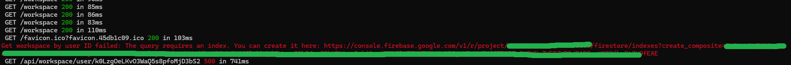

# JIRA CLONE DOCUMENTATION

 

Some Firebase API with get error if you haven't created index of document for example at: `app/api/workspace/user/[id]/route.ts`

```javascript
const q = query(
  joinWorkspaceRef,
  where("userId", "==", id),
  orderBy("createdAt", "asc")
);
```

Just click a link error in your app console to direct to firebase.console and create it, for example:


